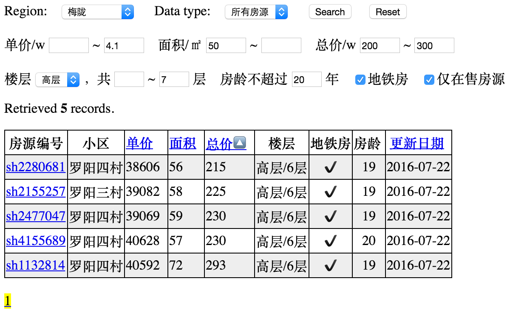
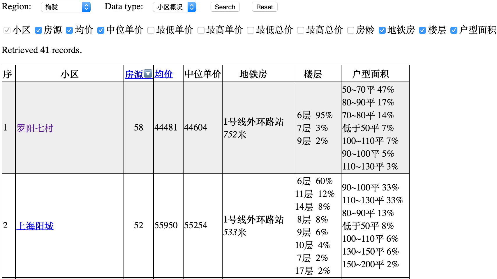
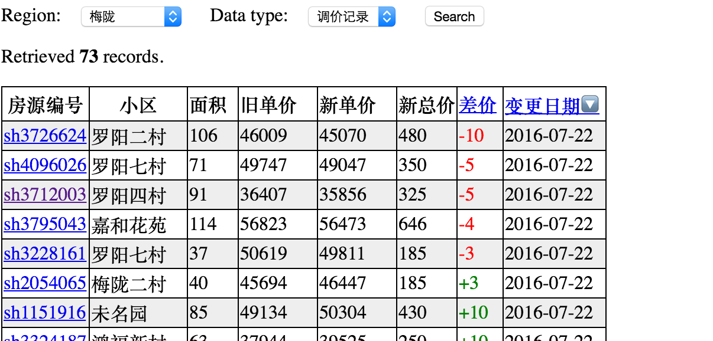

# What's this project for?
In 2016 summer I planed to buy an apartment in Shanghai. At that time lianjia.com is popular for viewing apartments info online. So I want to keep track of apartments' price changes from lianjia, with a tool. Then comes this crawler.

BTW, before the crawler was finished and came to use, I've bought one in three days...

# Snapshots
**Search for all apartment in a region, with various contraints.**



**Search for community in a region, with all kinds of statistical data.**



**Search for apartments' price change.**



# Prerequisites
Prerequisites includes installing python/MySQL/Apache server and necessary python modules.
Choose according to your OS.

[Mac OS X](doc/prerequisite_mac.md) &nbsp;&nbsp; 
[Ubuntu](doc/prerequisite_ubuntu.md) &nbsp;&nbsp; 
[Centos](doc/prerequisite_centos.md) &nbsp;&nbsp; 
[Windows 7](doc/prerequisite_windows.md)

# Change crawler configurations
In lianjia\_crawler\_conf.py, perform configuration changes according to comments.

+ Check MySQL configurations in **MySQL\_conf**, set connection parameters. Be careful about the user/password. Confirm it with "*mysql -u root -p*" to log into MySQL, if you use root. When asking for password, just press enter.

+ Create a database named lianjia in MySQL with command *"CREATE DATABASE lianjia"*.

+ Define the regions you are caring about in **region_def**.

# Run crawler
+ In shell, run *"chmod u+x lianjia\_crawler.py"* and *"./lianjia\_crawler.py"*.
+ On Mac OS/Linux, Use cron to schedule the crawler running every day. Here is an example from Mac OS X.
 - Create a shell script, setting the Python path. Like file name *lianjia_crawler.sh*, with content,
 
 ```sh
 #!/bin/bash
 export PATH=/opt/local/Library/Frameworks/Python.framework/Versions/2.7/bin: $PATH
 /Users/xyz/lianjia/lianjia_crawler.py >> /Users/xyz/lianjia/lianjia_crawler.log 2>&1
```
 - Install task in cron with *"sudo crontab -e"*, run the script 12:00 every day.
 
 ```
 00 12 * * * /Users/xyz/lianjia/lianjia_crawler.sh
 ```

# View lianjia data in browser
+ In browser(recommend Chrome!), type in "*localhost*" as the address.
